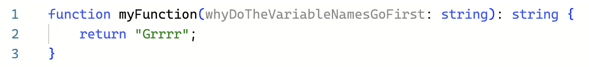

That's right. I'm a newbie to TypeScript. It was a slow start, if I'm being honest; as educational as they were, the <a href="https://example.com">freeCodeCamp 
tutorial on JavaScript</a> was admittedly a bit boring, and the <a href="https://example.com">W3 Schools TypeScript tutorial</a> was even boring-_er_. Still, I have come to anticipate enjoying it nonetheless.

## Not quite love at first sight...

I mean, sure, I found certain things a bit strange, like the syntax of a function definition line—specifically the syntax of the parameters. I’m used to the way Java and C++ does it: data type _then_ argument name. But TypeScript totally flips the script!

  

Like, what? That goes against everything I’ve ever known! Oh well. We adapt and we learn (and I’m mostly joking anyway).

## On the very bright side

It was _doing_ that helped me see the light.

What I find to be the biggest appeal in TypeScript so far, though, is the ability to return multiple data types with one function. That, by the way, also goes against everything I’ve ever known—but, you know, in a good way. The WODs help me appreciate the language. They’re surprisingly kind of fun. As stressful as I found the idea of them, I've come to like being challenged to think on the spot. The pride I feel after solving the exercise is a real confidence-booster. I'm working faster than I thought I would. Well, to be fair, these are still only the beginning WODs, so they'll probably only get more difficult from here. Let's just hope my problem-solving abilities grow alongside the WOD complexity.

All in all, I can picture being grateful for what TypeScript offers once I start using it to work on bigger projects. From what I've heard, it has features that can make programming a lot more convenient. I'm excited to continue on and see what TypeScript's got in store for me!
