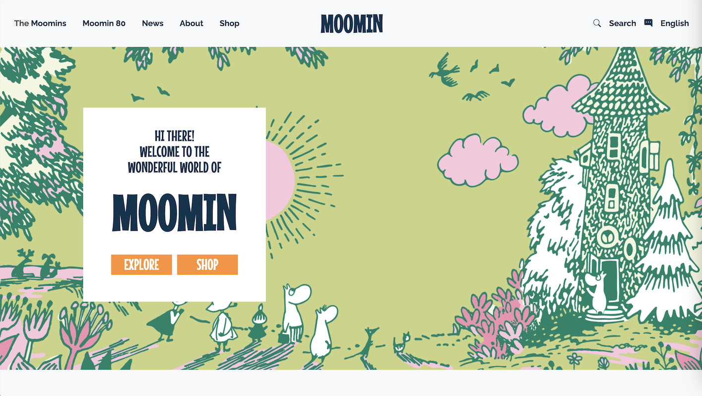

## With great power comes great responsibility... and a giant headache

Raw HTML and CSS is one extreme: full control but lots of manual work—a real pain in the butt for anything beyond a simple page. But Bootstrap 5 on its own is on the opposite end of the spectrum: fast and structured yet sometimes restrictive. You know me, I like to write my own destiny. I will not be confined to rigid layouts and generic styles! At the same time, relying solely on HTML and CSS puts a little _too_ much control at my fingertips. You think I’m going to sit here and micromanage every pixel? N to the O. I’m not playing god!
  
It’s clear that I’m not exactly leaning one way or the other. Rather, there’s a sweet spot we have to find. Allow me to introduce you to the “Bootstrap Base” plus “custom CSS” combo. This approach allows us to leverage Bootstrap's responsive design and grid system while still having the ability to customize the appearance and functionality of our websites. In other words, Bootstrap handles the heavy lifting, and custom CSS gives us the flexibility to fine-tune details. It’s a great balance between efficiency and control. This way, I don’t have to play god. I’m more like a minor deity.

 

## The Goldilocks zone

That being said, despite its simplicity compared to raw HTML and CSS, there are challenges to using Bootstrap as well. For one, the learning curve can be steep for beginners, but this is mostly because of the vast array of classes you have to get familiar with—and I mean _really_ familiar. Thankfully, it gets easier once you get the hang of it due to repetition and memorization. Bootstrap is just _faster_ to work with.

Check out the [Moomin](https://www.moomin.com/en/) home page I recreated in Bootstrap (and a fair bit of CSS):

 

  

 

Pretty nifty what these guys can let us do.

Combining Bootstrap with custom CSS allows me to inject my personality into my projects, ensuring that my designs remain unique while still benefiting from the foundation Bootstrap offers. This approach strikes a balance between control and convenience. I can use Bootstrap as a base while still harnessing the creative freedom I crave. So, rather than seeing Bootstrap as a restriction, I view it as the sibling of HTML and CSS. Those three go together, and I don’t plan on separating them.
