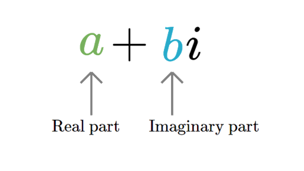

  

This Complex class was a three-part solo project I completed in ICS 212, Fall 2024 using using [UH Unix](https://www2.hawaii.edu/~rnarayan/ics212/main_sub/uhunix.html). It takes user input for two complex numbers and performs arithmetic operations such as addition, subtraction, multiplication, and division, as well as equality and inequality checks. By implementing the Complex class, I gained the opportunity to strengthen my understanding of C++ syntax and object-oriented programming.

I encountered several key concepts in C++ during the implementation of the Complex class, most notably operator overloading and input/output streams that interact with the user.

As the programmer of the project, I was responsible for defining the Complex class and its member functions, ensuring that it could handle complex number computations. Here is a sample of the operations it supports:

<pre style="background-color: lightgrey; white: white; padding: 10px;">
  <code>
 /**
   * ADDS the current Complex number to another
   * @param addComplex   the Complex object to be added to the current object
   * @return a new Complex object that represents the sum of the two complex numbers  
   */
  Complex add(const Complex &addComplex) const {
    // follows formula (a + bi) + (c + di) = (a + c) + (b + d)i
    double newReal = real + addComplex.real;
    double newImaginary = imaginary + addComplex.imaginary;

    // return a new object with above sums as parameters
    return Complex(newReal, newImaginary);
  }

  /**
   * SUBTRACTS another Complex object from the current one
   * @param subtractComplex   the Complex object to be subtracted from the current object
   * @return a new Complex object that represents the difference of the two complex numbers
   */
  Complex subtract(const Complex &subtractComplex) const {
    // follows formula (a + bi) - (c + di) = (a - c) + (b - d)i
    double newReal = real - subtractComplex.real;
    double newImaginary = imaginary - subtractComplex.imaginary;

    // return a new object with above differences as parameters
    return Complex(newReal, newImaginary);
  }
</code></pre>

Source: <a href="https://github.com/jogarces/ics-313-text-game"><i class="large github icon "></i>jogarces/ics-313-text-game</a>
