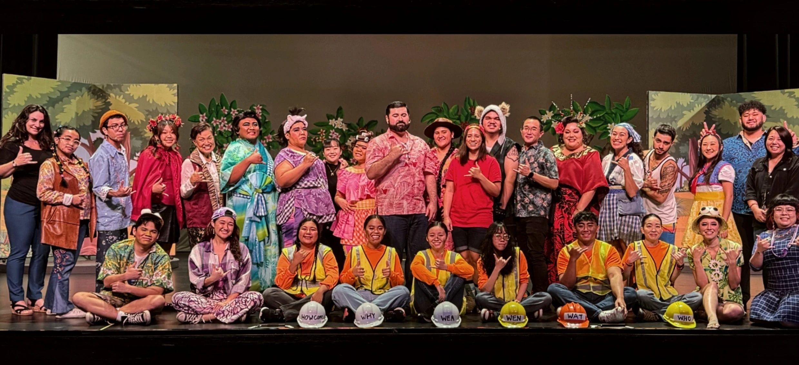
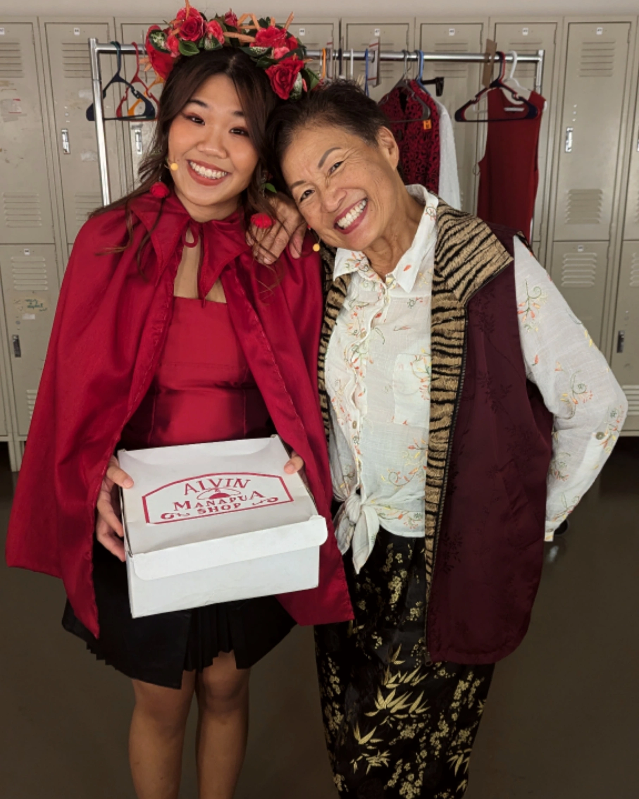

    
  

  

In Fall 2024, I performed on stage at Leeward Community College Theatre in a production of Lisa Matsumoto's [Once Upon One Time](https://www.broadwayworld.com/hawaii/regional/Lisa-Matsumoto-s-ONCE-UPON-ONE-TIME-2796288), a musical full of classic fairytales—all told in pidgin. My role was Red Rose Haku, the local version of Little Red Riding Hood.

Cooperation and communication is an absolutely essential aspect of acting. I had to not only collaborate with a cast of twenty-four other people but also critically listen to my director and his assistant directors as they brought the scenes to life. I was constantly adapting, both taking in my director's feedback and growing into my character alongside my castmates. Through this experience, I came to appreciate the importance of flexibility and patience, as well as the unified nature of live theater, where each person's role is integral to the overall production. As my director would always tell us, <b>"Each and every one of you are main characters."</b>

Working with all kinds of different people is a part of life that will never go away. It is especially present in tech careers, where collaboration is crucial for success. Whether it’s working on a software development project or troubleshooting issues with a team, the ability to work effectively in diverse teams is key. Just like in theater, where I learned to trust my castmates and adapt to changes, in my career as a software developer, I’ll need to be open to adapting, receptive to feedback, and ready to evolve with my colleagues _and_ with technology.
